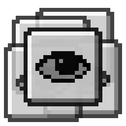

| [中文](README.zh.md) | English |
| :------------------: | :-----: |

<div align="center">



# Perspective API

[中文](README.zh.md) | English


[](https://modrinth.com/mod/perspective-api)
[](https://www.curseforge.com/minecraft/mc-mods/perspective-api)

</div>

Perspective API is a camera perspective management framework for Minecraft client-side mods. It provides standardized interfaces using the JOML library to handle camera states (position, rotation, FOV), decoupled from Minecraft internals.

## Key Features

- **Roll**: Camera rotation is specified with quaternions, so roll is fully supported
- **Smooth Transitions**: Interpolated transitions for position, rotation, and FOV ensure natural perspective switches
- **Priority-Based Override Chain**: High-priority temporary perspectives (e.g., cutscenes, GUI-forced views) automatically override base perspectives
- **Built-in Perspective Cycler**: Takes over the vanilla F5 toggle key, allowing players to cycle through registered perspectives

## Compatibility Matrix

| Minecraft Version | Fabric | NeoForge | Forge (Legacy) |
| :---------------: | :----: | :------: | :------------: |
|      1.20.1       |   ✅   |    ❌    |       ✅       |
|      1.20.4       |   ✅   |    ✅    |       ❌       |
|      1.20.6       |   ✅   |    ✅    |       ❌       |
|       1.21        |   ✅   |    ✅    |       ❌       |
|      1.21.11      |   ✅   |    ✅    |       ❌       |
|      26.1.x       |   ✅   |    ✅    |       ❌       |
|       26.2        |   ✅   |    ✅    |       ❌       |

> [!WARNING]
> This API is currently unstable and subject to breaking changes at any time.

## Core Concepts

### Perspective

A `Perspective` defines a camera behavior. Each perspective has a unique `Identifier` and implements per-frame callbacks to modify camera position, rotation, and FOV. It also exposes lifecycle hooks (`onActivate` / `onDeactivate`) and availability checks (`isAvailable`).

When `applyTransform` and `applyFov` make no modifications, the camera falls back to a vanilla camera type specified by `cameraType()`.

Transitions in and out of a perspective can be individually enabled or disabled.

### Perspective Registration

Perspectives can be registered via the Java SPI mechanism (`PerspectiveRegistrar` interface) for automatic discovery, or manually through the registry.

### Override Chain

The override chain is a priority-based evaluation mechanism for temporary camera control. Each entry provides a `Supplier<Identifier>` evaluated by descending priority. The first entry to return a valid perspective ID wins, and that perspective is applied. This is ideal for scenarios like custom GUIs or cutscenes that need to temporarily take over the camera.

### Perspective Cycler

The cycler manages the list of perspectives players traverse with the vanilla toggle key (F5). It includes three built-in perspectives corresponding to vanilla First-person, Third-person Back, and Third-person Front. Custom perspectives can be added with a priority that determines their position in the cycle.

The cycler itself acts as a low-priority override entry. If a higher-priority override is active, the cycler's selection is temporarily ignored.

### Perspective Modifier

Modifiers apply additional mathematical transformations to the camera state **after** the base perspective establishes the target state but **before** transition interpolation. This is useful for effects like screen shake, movement tilt, or vehicle roll that should layer on top of any perspective.

Modifiers are registered with a key, a priority, and executed in ascending priority order.

**Execution order:** Base Perspective → Modifiers (by priority) → Sanitize → Transition

## Adding Dependencies

### Modrinth Maven

Notation format: `"maven.modrinth:perspective-api:${version}+${loader}-${minecraft_version}"`

```build.gradle.kts
repositories {
  exclusiveContent {
    forRepository {
      maven {
        name = "Modrinth"
        url = uri("https://api.modrinth.com/maven")
      }
    }
    filter {
      includeGroup("maven.modrinth")
    }
  }
}

dependencies {
  implementation("maven.modrinth:perspective-api:1.0.0-beta.1+fabric-26.2")
}
```

## Demo

See the demo mod [Perspective API Demo](https://github.com/Leawind/Perspective-API-Demo).
