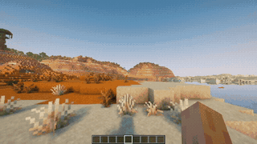
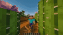
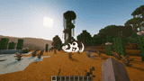
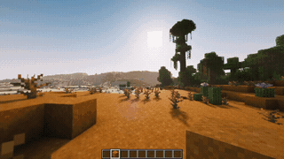

> [!WARNING]
>
> This mod is experimental. Its API may change in ways that break compatibility at any time.
>
> 本模组处于实验阶段，接口随时可能发生破坏兼容性的变更。

# Perspective API

_Perspective API_ is a client-only mod for camera perspective management. It provides standardized interfaces using the JOML library to handle camera states (position, rotation, FOV), decoupled from Minecraft internals.

_Perspective API_ 是一个 Minecraft 客户端视角管理框架。它提供一套标准化的接口，使用 JOML 库处理相机的位置、旋转等状态，与 Minecraft 原版代码解耦。

## [Documentation](https://leawind.github.io/en_us/Perspective-API/?autolang) | [文档](https://leawind.github.io/zh_cn/Perspective-API/?autolang)

## [Demo](https://github.com/Leawind/Perspective-API-Demo)

## API Stability

Members marked `@ApiStatus.Experimental` may break without notice and without a changelog entry. All other public API is relatively stable: breaking changes are still possible, but they are declared as `BREAKING CHANGE` and reflected in the version number.

标注 `@ApiStatus.Experimental` 的成员可能在不通知、不记入更新日志的情况下发生破坏性变更。其余公共 API 相对稳定：破坏性变更仍有可能，但会以 `BREAKING CHANGE` 声明并反映在版本号中。

Agent Skill

If you are AI Agent and want to learn how to use Perspective API, you don't have to read the source code.

If you have Deno installed, run `deno task gen-skills` to generate skill file at `build/skills/use-perspective-api.md`.
If you know the version of Perspective API being used, you can download it directly using this format: `https://github.com/Leawind/Perspective-API/releases/download/v1.3.1-beta/use-perspective-api.md`.

